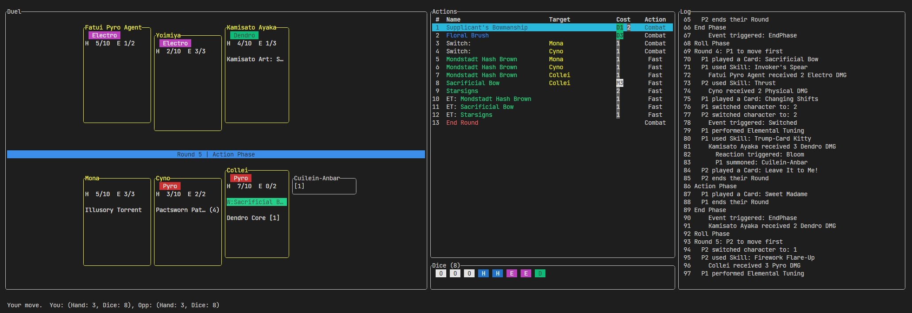

# GITCGSim

A Genius Invokation TCG simulator written in Rust.


```
# Run the terminal-based simulator
cargo run --release

# Run the minimax benchmark
cargo run --release --bin gitcg_benchmark
```

# Command line simulator

Controls:

 - `Up`/`Down` or `PageUp`/`PageDown`: Scroll through the log
 - `j`, `k`: Move up/down in the actions list
 - `Enter`: Perform the selected action
 - `1` - `9` and `0`: Perform the 1st - 10th action
 - `q`: Exit



# Unimplemented features

 - Features
    - WebAssembly build
    - Custom decks and deck editor
 - TCG mechanics
    - Pick starting character
    - Draw 5 cards and mulligan
    - Manual dice selection for cost payments
 - Characters
    - Beidou
    - Mirror Maiden
    - Rhodeia of Loch
    - Maguu Kenki
    - Stonehide Lawachurl
 - Cards
    - Character Talent cards
    - Elemental Resonance
    - Most Food and Event cards
    - Support

# The game state

The `GameState` struct holds the TCG game state.

Actions can be performed onto the game state by calling the `advance` method with
the input, which can be:
 - From a player: such as casting skills or switching characters
 - Non-deterministic: such as rolling Elemental Dice or drawing cards


There is no way to undo actions, but cloning game states is very fast.

## Error handling

The `advance` method returns an `Err()` if the input fails validation, such as not
being able to pay the cost or casting a wrong skill.

If an `Err()` is returned, then the game state is invalidated. For example, the 
cost is already paid but the effect did not happen.

The `advance` method panics if there is a bug with the card or TCG implementation.

## Game state mutation

Elements of card effect such as dealing DMG or healing are represented using
`Command`s, which are executed by the TCG implementation to update the game state
accordingly.

There is a command for triggering events such as entering the End
Phase or after casting a skill.

# Cards and statuses

The `cards` module contains the definitions of TCG cards.

## Example: "Yoimiya"

```rust
// cards::characters::yoimiya
use ...;

pub const C: CharCard = CharCard {
    name: "Yoimiya",
    ...
    skills: list8![
        SkillId::FireworkFlareUp,
        SkillId::NiwabiFireDance,
        SkillId::RyuukinSaxifrage,
    ],
};

pub const FIREWORK_FLARE_UP: Skill = skill_na(
    "Firework Flare-Up",
    // Dice cost 1 Pyro + 2 unaligned
    Element::Pyro,
    // Deal 2 Physical DMG
    2,
    DealDMGType::Physical
);

pub const NIWABI_FIRE_DANCE: Skill = Skill { 
    name: "Niwabi Fire-Dance",
    skill_type: SkillType::ElementalSkill,
    // Dice cost: 1 Pyro
    cost: cost_elem(Element::Pyro, 1, 0, 0),
    // This Skill does not grant Energy
    no_energy: true,
    // Does not deal DMG
    deal_dmg: None,
    // This character gains Niwabi Enshou
    apply: Some(StatusId::NiwabiEnshou),
    ..Skill::new(),
};

pub const RYUUKIN_SAXIFRAGE: Skill = Skill {
    name: "Ryuukin Saxifrage",
    skill_type: SkillType::ElementalBurst,
    // Dice cost: 4 Pyro, energy cost: 3
    cost: cost_elem(Element::Pyro, 4, 0, 3),
    // Deal 4 Pyro DMG
    deal_dmg: Some(deal_elem_dmg(Element::Pyro, 4, 0)),
    apply: Some(StatusId::AurousBlaze),
    // Fill in default fields
    ..Skill::new(),
};
```

Statuses are implemented using the `StatusImpl` trait.

```rust
pub const NIWABI_ENSHOU_STATUS: Status = Status::new_usages(
    "Niwabi Enshou",
    // Attaches to a character
    StatusAttachMode::Character,
    // Usage(s): 2
    2,
    // No specified stacking
    None
);

// This macro creates an empty struct named NiwabiEnshou
decl_status_impl_type!(NiwabiEnshou);
impl StatusImpl for NiwabiEnshou {
    // This status changes outgoing damage
    fn responds_to(&self) -> EnumSet<RespondsTo> {
        enum_set![RespondsTo::OutgoingDMG]
    }

    fn outgoing_dmg(&self, _eff_state: &AppliedEffectState, ctx: &CommandContext, dmg: &mut DealDMG) -> Option<AppliedEffectResult> {
        // Check for Normal Attack
        if ctx.src.skill_id() == Some(SkillId::FireworkFlareUp) {
            // Physical DMG is converted to Pyro DMG
            dmg.infuse(DealDMGType::PYRO);
            // Increase DMG by 1
            dmg.dmg += 1;
            // Decrement usage counter by 1
            return Some(AppliedEffectResult::ConsumeUsage);
        }
        None
    }
}

pub const AUROUS_BLAZE_STATUS: Status = Status::new_duration(
    "Aurous Blaze", 
    // Team Combat status
    StatusAttachMode::Team,
    // Duration (Rounds): 2
    2
);

decl_status_impl_type!(AurousBlaze);
impl StatusImpl for AurousBlaze {
    // This status has event triggers
    fn responds_to(&self) -> EnumSet<RespondsTo> {
        enum_set![RespondsTo::TriggerEvent]
    }

    // The event triggers on a skill being casted
    fn responds_to_triggers(&self) -> EnumSet<EventId> {
        enum_set![EventId::SkillCasted]
    }

    fn trigger_event(&self, e: &mut TriggerEventContext) -> Option<AppliedEffectResult> {
        // After your character other than Yoimiya uses a Skill:
        if !e.is_casted_by_character(CharId::Yoimiya) {
            // Deal 1 Pyro DMG
            e.cmd_deal_dmg(DealDMGType::PYRO, 1, 0);
            return Some(AppliedEffectResult::ConsumeUsage);
        }
        None
    }
}

```

## Example: "Leave It to Me!"
```rust
// cards::event::leave_it_to_me
use ...;

pub const C: Card = Card {
    name: "Leave It to Me!",
    cost: Cost::ZERO,
    effects: list8![
        Command::ApplyStatusToTeam(StatusId::LeaveItToMe)
    ],
    card_type: CardType::Event,
};

decl_status_impl_type!(LeaveItToMe, I);
impl StatusImpl for LeaveItToMe {
    fn responds_to(&self) -> EnumSet<RespondsTo> {
        enum_set![RespondsTo::SwitchIsFastAction]
    }

    fn switch_is_fast_action(&self, _ctx: &AppliedEffectState, value: &mut bool) -> Option<AppliedEffectResult> {
        *value = true;
        Some(AppliedEffectResult::ConsumeUsage)
    }
}
```

## Card implementations

For cards with complex logic such as selections and activation condtions, they can implement the `CardImpl` trait.

For example:

```rust

pub struct ElementalArtifact2 { 
    pub elem: Element,
    pub status_id: StatusId,
}

// Cost-2 elemental artifacts
impl CardImpl for ElementalArtifact2 {
    fn selection(&self) -> Option<CardSelectionSpec> {
        Some(CardSelectionSpec::OwnCharacter)
    }

    fn get_effects(
        &self, 
        cic: &CardImplContext,
        ctx: &CommandContext, 
        commands: &mut CommandList<(CommandContext, Command)>
    ) {
        if let CardSelection::OwnCharacter(i) = cic.selection.unwrap() {
            commands.push(
                (*ctx, Command::ApplyEquipmentToCharacter(EquipSlot::Artifact, self.status_id, i))
            )
        }
    }
}

// Food cards (targeting and enforcing the "Satiated" status)
impl CardImpl for FoodCardImpl {
    fn selection(&self) -> Option<CardSelectionSpec> {
        Some(CardSelectionSpec::OwnCharacter)
    }

    fn can_be_played(&self, cic: &CardImplContext) -> CanBePlayedResult {
        match cic.selection {
            Some(CardSelection::OwnCharacter(char_idx)) => {
                let player = cic.game_state.get_player(cic.active_player_id);
                if player.status_collection.has_character_status(char_idx, StatusId::Satiated) {
                    CanBePlayedResult::InvalidSelection
                } else {
                    CanBePlayedResult::CanBePlayed
                }
            },
            None => CanBePlayedResult::InvalidSelection,
        }
    }

    fn get_effects(
        &self, 
        cic: &CardImplContext,
        ctx: &CommandContext, 
        commands: &mut crate::data_structures::CommandList<(CommandContext, Command)>
    ) {
        for eff in cic.card.effects.to_vec() {
            commands.push((*ctx, eff))
        }
        
        if let CardSelection::OwnCharacter(i) = cic.selection.unwrap() {
            commands.push((*ctx, Command::ApplyStatusToCharacter(StatusId::Satiated, i)));
        }
    }
}
```

# Search algorithm

The algorithm to play the TCG is a negamax algorithm using the following techniques:

- [Alpha-beta pruning](https://en.wikipedia.org/wiki/Negamax#Negamax_with_alpha_beta_pruning)
- Iterative deepening
- [Principal variation](https://www.chessprogramming.org/Principal_Variation) (PV) move ordering
  - Moves of the same category as the PV (casting a skill, switching characters or playing a card) are next-in-line for move ordering 
- Transposition table with incrementally updated Zobrist hashing
- Aspiration windows
- [Lazy SMP](https://www.chessprogramming.org/Lazy_SMP) for parallelism
- Position evaluation function based on total HP, elemental application, statuses, summons and resources (hand, dice)

## Handling randomness
On non-determinstic branches (Elemental Dice, drawing cards), one random outcome is sampled.

## Hidden information
Before feeding into the search algorithm, the opponent's hand is converted to blank cards (unplayable and can only be used for Elemental Tuning) and the opponent's dice is re-rolled.

## Potential improvements

- Find ways to avoid the horizon effect (where the losing computer player inserts delaying actions)
- Simulate a simplified version of the game (no cards, only skills and switching) before evaluating the heuristic
- "Known"/"Unknown" states for opponent's card and dice
